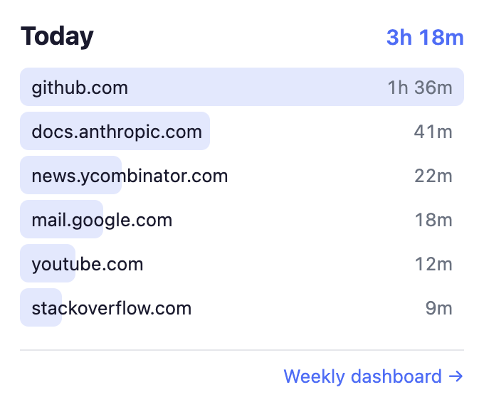
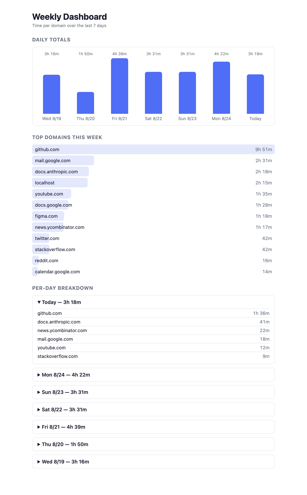

<div align="center">

# Domain Time Tracker

**A Chrome extension that tells you where your day actually went — one popup, seven days of history, and not a single byte leaving your machine.**

No account, no sync, no server, no build step. Load the folder, close the tab, forget it's there.



</div>

---

## Why this one

Every time tracker asks you to trust it with your browsing history. This one
can't leak it: there are no host permissions, no content scripts, no network
code anywhere in the extension. Totals live in `chrome.storage.local` and die
with your profile.

The harder problem is that Manifest V3 makes accurate tracking genuinely
difficult, and most extensions get it wrong. Chrome **kills a service worker
after ~30 seconds of inactivity**, so anything holding a session in a variable
or ticking on `setInterval` quietly stops counting — usually working perfectly
while you have DevTools open, because DevTools keeps the worker alive, and
losing hours the moment you close it.

This extension holds no state in memory at all. It's a stateless event handler
over storage with a one-minute alarm heartbeat, so it can be killed at any
instant and lose at most a minute. That architecture is the actual product —
it's [packaged as a skill](#steal-the-method) you can install into your own
assistant.

## Proof

Today, in the popup, with the weekly dashboard one click away:



Both screenshots are the real extension rendering real `chrome.storage.local`
in a real Chrome — captured headlessly by [`tools/capture.mjs`](tools/capture.mjs),
with only the numbers seeded. And the tracking loop is verified end-to-end
against a live browser:

```
$ node tools/smoke-test.mjs

service worker
  ok  registers a heartbeat alarm
  ok  uses chrome.alarms, never setInterval/setTimeout (they die with the worker)

tracking loop
  ok  opens a session for the focused tab's domain — got {"domain":"127.0.0.1",...}
  ok  credits elapsed time to that domain — 4473ms credited over ~3s

guards
  ok  discards gaps longer than the sleep guard — 0ms credited for a 1h gap
  ok  splits a span across local midnight into two day buckets — yesterday=60000ms today=60000ms

all checks passed
```

## Install it (60 seconds)

1. [Download the repo as a ZIP](https://github.com/satvik314/timer/archive/refs/heads/main.zip) and unzip it — or `git clone https://github.com/satvik314/timer.git`
2. Open `chrome://extensions` and turn on **Developer mode** (top right)
3. Click **Load unpacked** and select the **`extension/`** folder

That's it. Click the toolbar icon for today's totals; the footer link opens the
weekly dashboard. Works in Chrome, Edge, Brave, Arc, and anything else on
Chromium.

Optional, if you want to run the tooling:

```bash
node tools/smoke-test.mjs   # end-to-end check against a real headless Chrome
node tools/capture.mjs      # regenerate the README screenshots
```

Both drive Chrome over the DevTools protocol with zero npm dependencies. They
reuse a Chromium from `~/Library/Caches/ms-playwright`, or set `CHROME_BIN` to
any Chrome binary.

## What counts as time

Time is credited to a domain only while **all** of these hold:

- its tab is the **active tab** of the **focused window**, and
- you are **not idle or locked** (60s threshold, via `chrome.idle`), and
- the URL is `http:`/`https:` — `chrome://` pages and the new tab are ignored

Switch tabs, navigate, unfocus the window, or walk away, and the current
session ends. Nothing is counted while you aren't there.

## The recipe

How the extension survives a service worker that keeps getting killed:

1. **No state in memory.** The open session lives at `activeSession: {domain, start}`
   in storage; totals live at `day:YYYY-MM-DD → {domain: ms}`. The worker can be
   terminated between any two lines without losing track.
2. **`start` is the last commit point, not the session start.** Every commit
   writes elapsed time to the day bucket and advances `start` to now — so
   commits are idempotent and the worst-case loss is one heartbeat.
3. **A `chrome.alarms` heartbeat, never `setInterval`.** Timers die with the
   worker; alarms wake it. Once a minute it commits progress and re-checks
   reality.
4. **Every event re-derives state instead of trusting bookkeeping.** Tab
   switch, navigation, window focus, idle change and the heartbeat all call the
   same `evaluateState()`, which asks the browser what's true right now. A
   cold-started worker reaches the same answer as a warm one.
5. **All storage writes go through a promise queue,** so two events landing in
   the same tick can't lose a read-modify-write race.
6. **Sleep guard.** Alarms don't fire while the machine sleeps, so any gap
   longer than 5 minutes is discarded rather than credited as browsing.
7. **Midnight splitting.** A span crossing local midnight is apportioned to
   both day buckets at commit time, using local date parts (never
   `toISOString()`, which is UTC and misfiles your evenings).
8. **Startup recovery and pruning.** On browser start, stale sessions are
   dropped and buckets older than 60 days are deleted.
9. **A `flush` message** lets the popup and dashboard ask the worker to commit
   the in-flight minute before they read, so what you see is current.

## Steal the method

The architecture above generalizes to anything an MV3 extension needs to
measure continuously — session length, presence, streaks, focus state. It ships
as a standalone agent skill:

```bash
npx skills add satvik314/timer
```

**Claude Code**, manually:

```bash
mkdir -p ~/.claude/skills/mv3-background-tracking && \
  curl -fsSL https://raw.githubusercontent.com/satvik314/timer/main/skills/mv3-background-tracking/SKILL.md \
  -o ~/.claude/skills/mv3-background-tracking/SKILL.md
```

**claude.ai**: download [`SKILL.md`](skills/mv3-background-tracking/SKILL.md) and upload it under
Settings → Capabilities → Skills.

**Any other assistant**: paste the contents of
[`skills/mv3-background-tracking/SKILL.md`](skills/mv3-background-tracking/SKILL.md)
into your rules or custom-instructions file.

Then ask for it:

> Build me an MV3 extension that tracks how long I keep each project's tab open — make it survive service worker suspension.

<details>
<summary>No skills support? Use this prompt instead</summary>

> Build a Manifest V3 Chrome extension that tracks time per domain. The service worker must hold **no** state in memory: store the open session as `activeSession: {domain, start}` and totals as `day:YYYY-MM-DD → {domain: ms}` in `chrome.storage.local`, where `start` is the last commit point so each commit is idempotent. Use a 1-minute `chrome.alarms` heartbeat instead of `setInterval`. Register all listeners at top level, and route every event (tab activated, tab updated, window focus changed, idle state changed, heartbeat) through one `evaluateState()` that re-derives what to track from `chrome.idle.queryState`, `chrome.windows.getLastFocused` and `chrome.tabs.query`. Serialize storage writes through a promise queue, discard elapsed gaps over 5 minutes (machine sleep), split spans across local midnight into separate day buckets using local date parts, clear stale sessions on startup, and expose a `flush` message so the popup can commit the partial minute before reading.

</details>

## Good for

- Finding out that "just checking something" is two hours a day
- Proving to yourself which docs site you actually live in
- Weekly reviews without installing a tracker that phones home
- A clean, dependency-free MV3 reference when you're building your own extension

## Contributing

PRs welcome. Useful ones: a monthly view, CSV export, per-domain ignore lists,
Firefox support — and improvements to
[the skill](skills/mv3-background-tracking/SKILL.md) itself, which is the part
other people install. If you change tracking behaviour, run
`node tools/smoke-test.mjs` and add a check for what you changed.

## Files

| Path | Purpose |
| --- | --- |
| `extension/manifest.json` | MV3 manifest — `tabs`, `storage`, `idle`, `alarms`, nothing else |
| `extension/background.js` | Stateless service worker: sessions, heartbeat, guards |
| `extension/popup.*` | Today's per-domain totals |
| `extension/dashboard.*` | 7-day chart, weekly top domains, per-day breakdown |
| `extension/common.js` | Shared storage + formatting helpers |
| `skills/` | The method, packaged for any AI assistant |
| `tools/` | Headless screenshot capture and the end-to-end smoke test |

[MIT](LICENSE) — do whatever you want with it.
